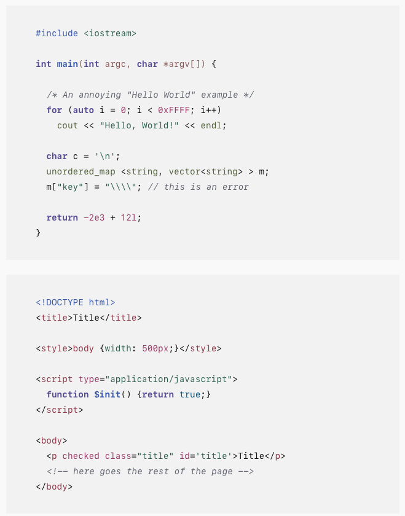
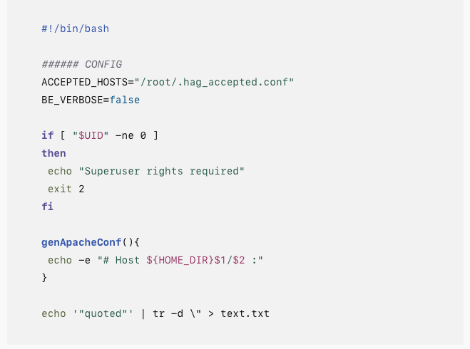
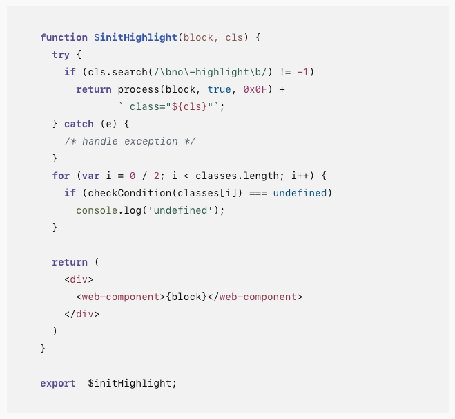
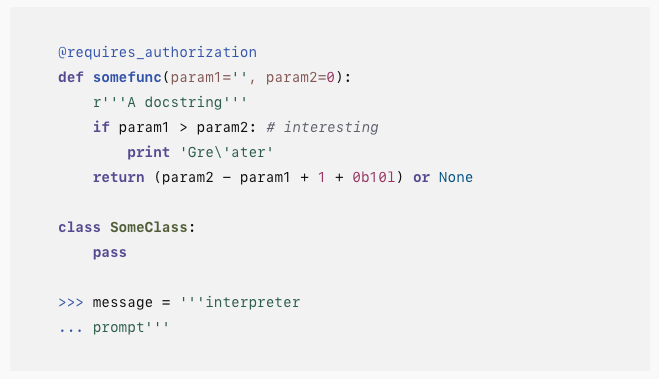

A [base16](https://github.com/chriskempson/base16) color theme for [highlight.js](https://highlightjs.org/)

_inspired by chinese traditional color_

- Low luminance colors
- Accessible colors (WCAG 2.0)

## How to use

The styles are defined in the file `chinese-palette.css`. Use however you like.

## Snapshots

