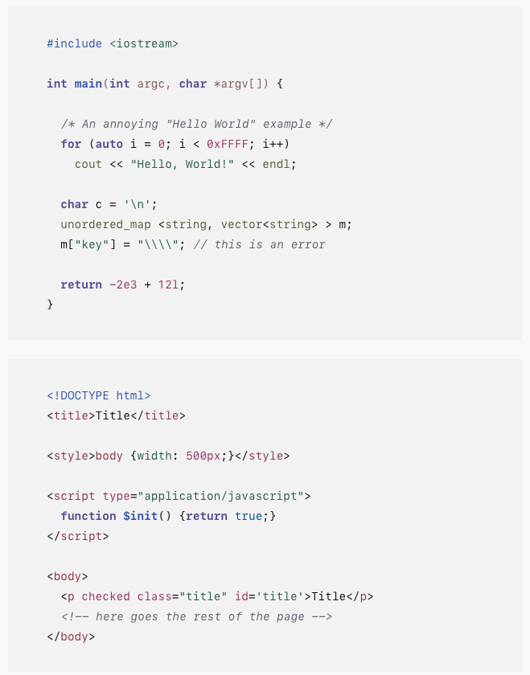
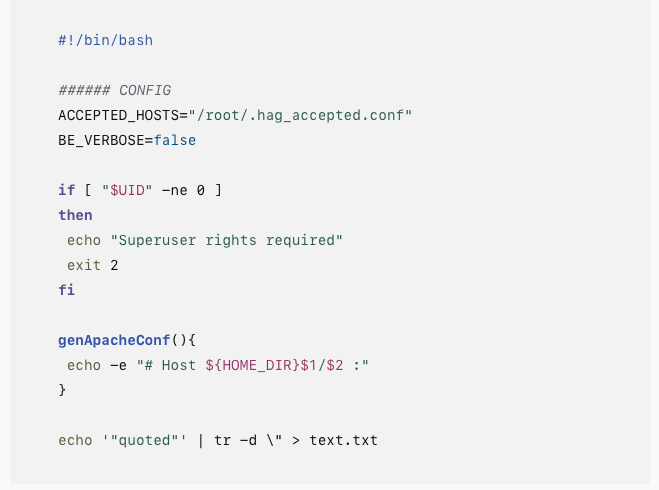
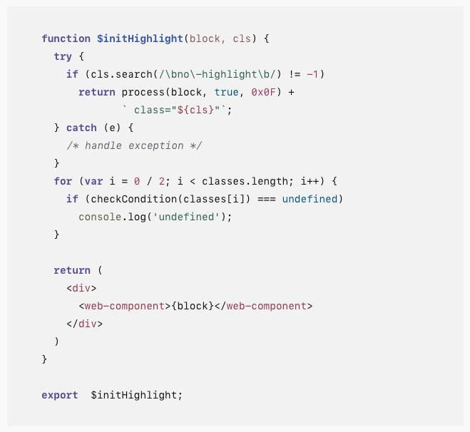
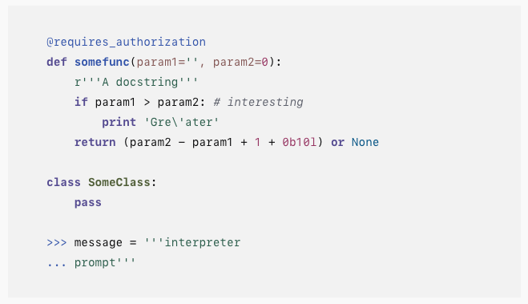

# Chinese Palette

A reusable CSS theme for personal sites, documentation, and prose-heavy pages, with a dedicated [highlight.js](https://highlightjs.org/) adapter.

_Inspired by Chinese traditional colors._

- Light theme with low-luminance accents
- Contrast-conscious defaults for body text, surfaces, and code blocks
- Semantic tokens separated from syntax-highlighting bindings

## Files

- `tokens.css`: raw Base16 palette plus semantic design tokens
- `theme.css`: general HTML element styling for pages, prose, forms, and tables
- `highlightjs.css`: syntax token bindings for `highlight.js`
- `chinese-palette.css`: convenience entrypoint that imports the three files above
- `demo/index.html`: preview page for the general theme and the code adapter

## Usage

### General website theme

```html
<link rel="stylesheet" href="tokens.css">
<link rel="stylesheet" href="theme.css">
```

### Add highlight.js styles

```html
<link rel="stylesheet" href="highlightjs.css">
```

### Convenience entrypoint

```html
<link rel="stylesheet" href="chinese-palette.css">
```

`chinese-palette.css` uses CSS `@import`, so keep `tokens.css`, `theme.css`, and `highlightjs.css` next to it when you deploy.

## Theme Tokens

The palette still exposes the Base16 colors as `--base00` through `--base0F`, but the general theme now prefers semantic aliases such as:

- `--color-bg`
- `--color-surface`
- `--color-text`
- `--color-border`
- `--color-link`
- `--color-accent`
- `--color-code-bg`
- `--syntax-comment`
- `--syntax-keyword`

You can override those tokens in `:root` or on a subtree with `data-theme="chinese-palette"`.

## Demo

Open `demo/index.html` in a browser to preview the generic site styles and the `highlight.js` adapter together.

## Snapshots

The original syntax-highlighting snapshots are still included for quick reference.





